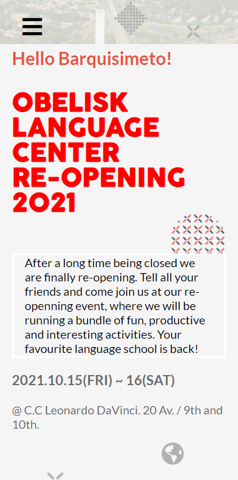

# Obelisk Language Center Re-opening Event

> This is the capstone project from the first module of Microverse Program.

This is a website buit for the re-opening event of Obelisk Language Center. Obelisk Language Center is a language school located in Barquisimeto, Venezuela, more precisely at the 20th Av / 9th and 10th on the second floor of the DaVinci's Commercial Center. This school is currently closed because of the pandemics and it really doesn't have a re-opening date, but lets hope things get better soon and Obelisk can restart operations!

## Built With

- HTML & CSS
- JavaScript

## Live Demo

[Live Demo Link](https://rpire.github.io/module-capstone-1)

## Loom Video

[Loom Video Link](https://www.loom.com/share/24ee684b00754f969a820aab74e5ae87)

## Getting Started

To get a local copy up and running follow these simple example steps.

### Get the repository into your PC.
- Clone this repository using this URL [https://github.com/rpire/module-capstone-1.git](https://github.com/rpire/module-capstone-1.git) or download it as a ZIP from the "Code" tab and extract the files.

### Usage
- To use it open the "index.html" file in your local copy of the repository after cloning or downloading.

## Authors

👤 **Rubén D. Pire L.**

- GitHub: [@rpire](https://github.com/rpire)
- Twitter: [@RubenPire7](https://twitter.com/RubenPire7)
- LinkedIn: [Rubén Darío Pire López](https://www.linkedin.com/in/rub%C3%A9n-dar%C3%ADo-pire-l%C3%B3pez-507111189/)

## 🤝 Contributing

Contributions, issues, and feature requests are welcome!

Feel free to check the [issues page](https://github.com/rpire/module-capstone-1/issues).

## Show your support

Give a ⭐️ if you like this project!

## Acknowledgments

- To [Cindy Shin](https://www.behance.net/adagio07), since the whole website is based on her template.

## 📝 License

This project is [MIT](./MIT.md) licensed.
